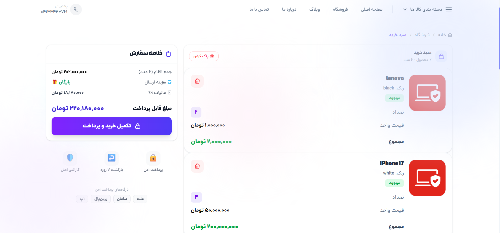
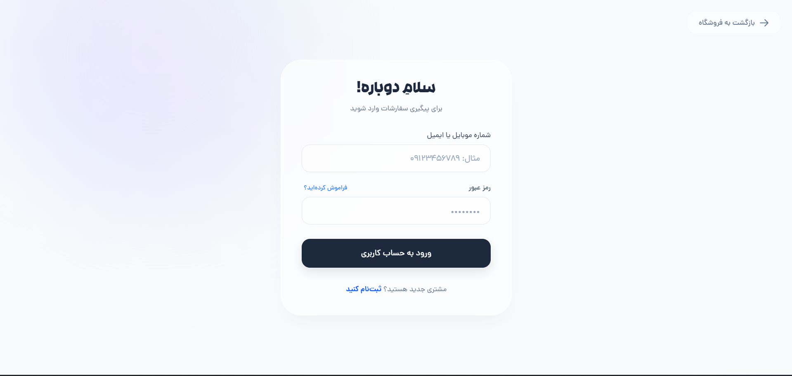
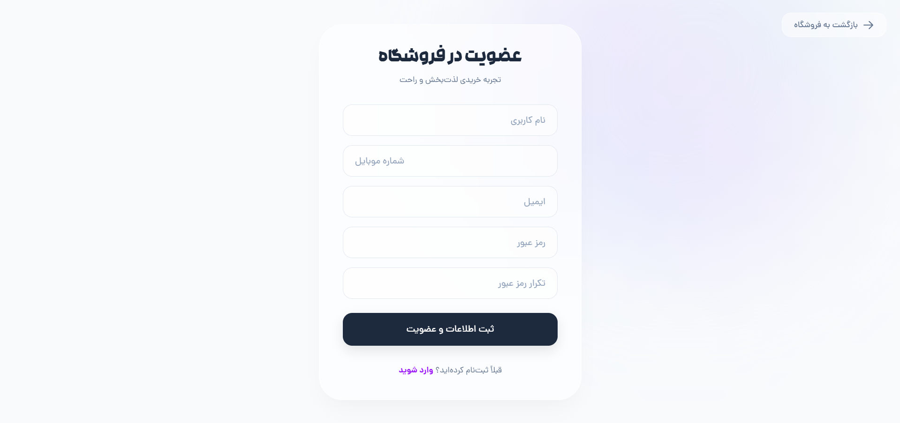
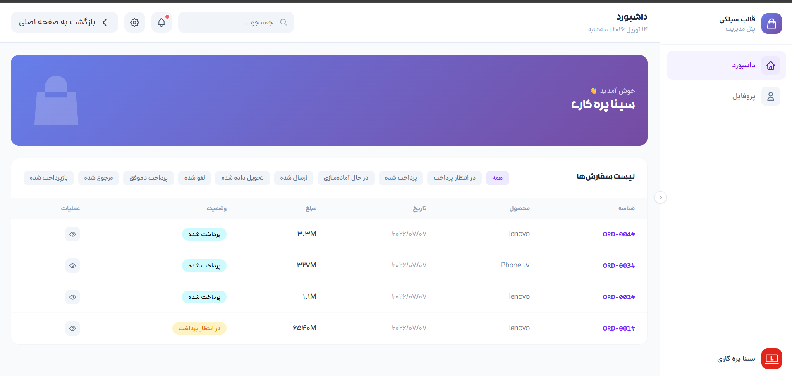
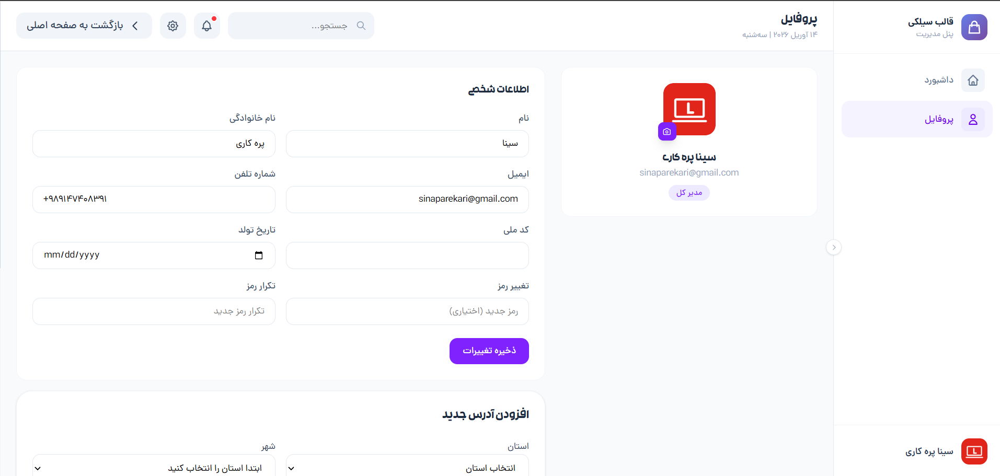
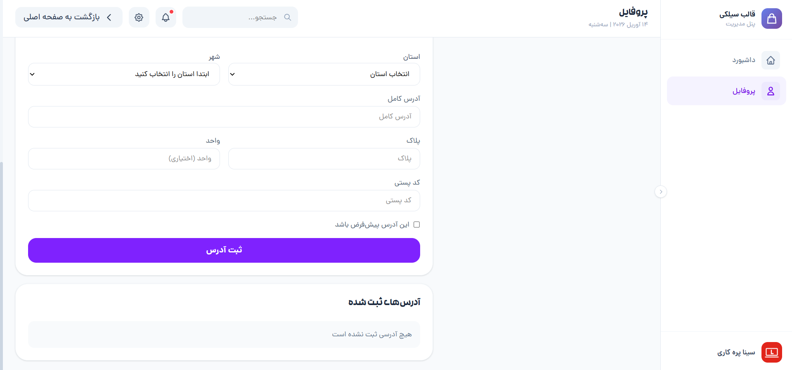
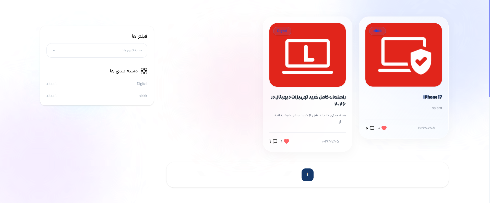
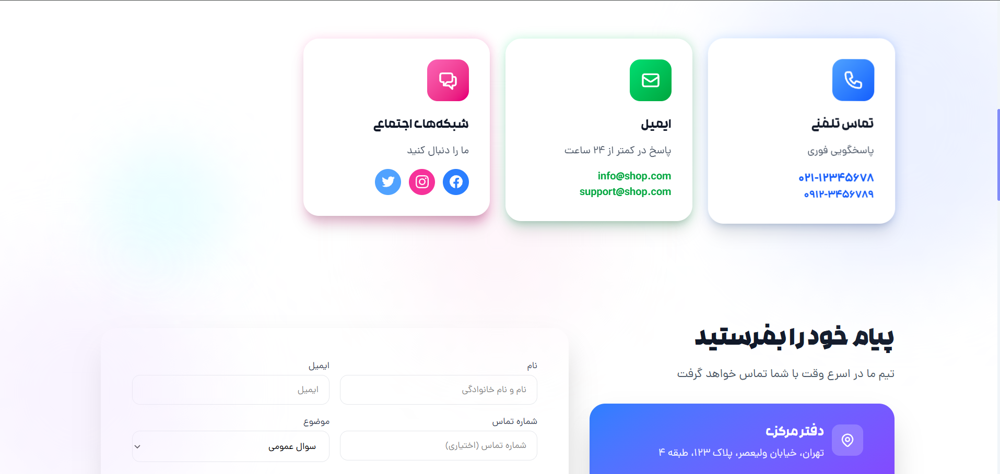
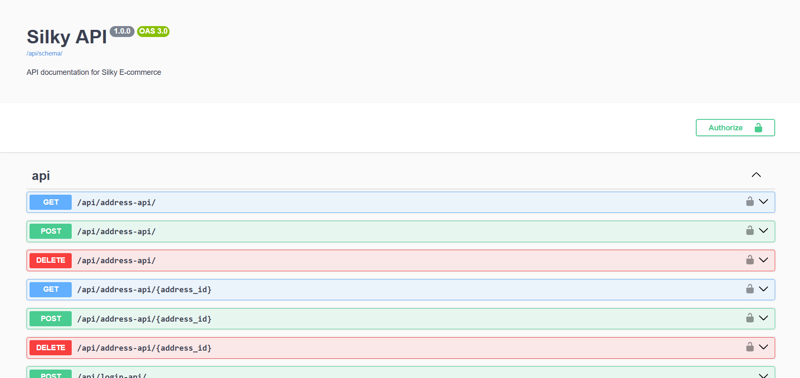

# Silky

A modern full-stack e-commerce platform built with **Django** and **Django REST Framework (DRF)**. Silky follows a modular architecture and provides a complete online shopping experience, including product management, shopping cart, order processing, payment integration, blogging, and REST APIs secured with JWT authentication.

---

## ✨ Features

### Authentication & Users
- User Registration & Login
- User Dashboard
- User Profile Management
- Address Management
- JWT Authentication for REST APIs

### Products
- Product Management
- Product Variants
- Product Detail Pages
- Product Categories & Nested Categories
- Product Filtering
- Product Rating & Review System
- Stock Management

### Cart
- Cart Management
- Cart Item
- Get full Price & final Price
- Increase & Decrease Items

### Order
- Order Management
- Order Item
- Get final Price

### Shopping
- Shopping Cart
- Cart Management
- Checkout Process
- Order Processing
- Order History
- Payment Gateway Integration (Zibal)

### Blog
- Blog Management
- Categories & Tags
- Responsive Blog Pages

### Contact
- Contact Us Page
- Contact Form Management

### API
- Django REST Framework
- JWT Authentication
- Swagger Documentation
- ReDoc Documentation

### General
- Responsive User Interface
- Modular Django Architecture
- Admin Dashboard
- Clean Project Structure

---

# 🛠 Tech Stack

## Backend

- Python 3.13
- Django 6.0.6
- Django REST Framework
- SQLite

## Frontend

- HTML5
- CSS3
- JavaScript
- Alpine.js
- Tailwind CSS

## Tools

- Git
- GitHub
- Swagger UI
- ReDoc

---

# 📁 Project Structure

```text
Silky
│
├── weblog/
├── cart/
├── category/
├── config/
├── core/
├── order/
├── payment/
├── product/
├── user/
│
├── media/
├── static/
├── templates/
│
├── requirements.txt
└── manage.py
```

---

# 📦 Installation

## Clone the repository

```bash
git clone https://github.com/SinaParekari/Silky.git

cd Silky
```

## Create Virtual Environment

```bash
python -m venv venv
```

### Windows

```bash
venv\Scripts\activate
```

### Linux / macOS

```bash
source venv/bin/activate
```

---

## Install Dependencies

```bash
pip install -r requirements.txt
```

---

## Configure Environment Variables

Create a `.env` file in the project root.

Example:

```env
SECRET_KEY=your-secret-key

DEBUG=True

ALLOWED_HOSTS=127.0.0.1,localhost

EMAIL_HOST=
EMAIL_PORT=
EMAIL_HOST_USER=
EMAIL_HOST_PASSWORD=
EMAIL_USE_TLS=True

ZIBAL_MERCHANT=

ACCESS_TOKEN_LIFETIME=
REFRESH_TOKEN_LIFETIME=
```

---

## Apply Database Migrations

```bash
python manage.py migrate
```

---

## Create Superuser

```bash
python manage.py createsuperuser
```

---

## Run Development Server

```bash
python manage.py runserver
```

Open:

```
http://127.0.0.1:8000/
```

---

# 📚 API Documentation

After running the project:

### Swagger UI

```
http://127.0.0.1:8000/api/docs/
```

### ReDoc

```
http://127.0.0.1:8000/api/redoc/
```

---

# 📷 Screenshots

## Home


---

## Products


---

## Product Details


---

## Shopping Cart



---

## Login



---

## Register



---

## Dashboard



---

## User Profile




---

## Blog




---

## Contact Us



---

## Swagger Documentation



---

# 🚀 Project Highlights

- Modular Django Architecture
- Django REST Framework APIs
- JWT Authentication
- Product Variant System
- Category & Subcategory Management
- Product Filtering
- Rating & Review System
- Shopping Cart
- Order Management
- Payment Gateway Integration
- Blog Management System
- Contact Management
- Responsive Design
- Admin Management Panel

---

# 📌 Roadmap

## Completed

- [x] User Authentication
- [x] JWT Authentication
- [x] Product Management
- [x] Product Categories
- [x] Product Variants
- [x] Product Ratings
- [x] Shopping Cart
- [x] Checkout
- [x] Order Management
- [x] Payment Integration
- [x] Blog System
- [x] Contact System
- [x] REST API
- [x] Swagger Documentation

## Planned

- [ ] PostgreSQL Support
- [ ] Docker Support
- [ ] Redis Caching
- [ ] Celery Background Tasks
- [ ] Unit & Integration Tests
- [ ] CI/CD Pipeline
- [ ] Email Verification
- [ ] Multi-language Support
- [ ] Performance Optimization

---

# 🤝 Contributing

Contributions are welcome!

If you'd like to improve this project:

1. Fork the repository
2. Create a feature branch
3. Commit your changes
4. Push the branch
5. Open a Pull Request

---

# 👨‍💻 Author

**Sina Parekari**

GitHub:

https://github.com/SinaParekari

---

# 📄 License

This project is licensed under the MIT License.